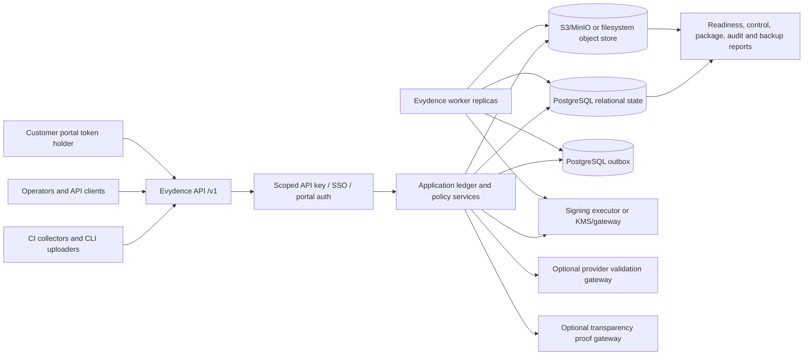

# Architecture Diagram

This explanation is a compact map of the current controlled self-hosted
production candidate architecture. It omits many resource families but shows the
trust boundaries operators need to understand first.

## Boundaries

- API clients and collectors are untrusted until authenticated and authorized.
- Tenant IDs are enforced at application and persistence boundaries.
- Raw payload bytes live in object storage under tenant-prefixed keys.
- PostgreSQL is the production source of truth for the controlled profile.
- Workers re-read object payloads and verify digests before parser side effects.
- Signing providers receive payload hashes or signing requests, not raw evidence
  payload bytes from Evydence.
- Provider validation, public transparency, broad WORM/object-lock proof, and
  native HSM custody remain deployment/provider responsibilities unless a
  specific deployment closes those checks.
