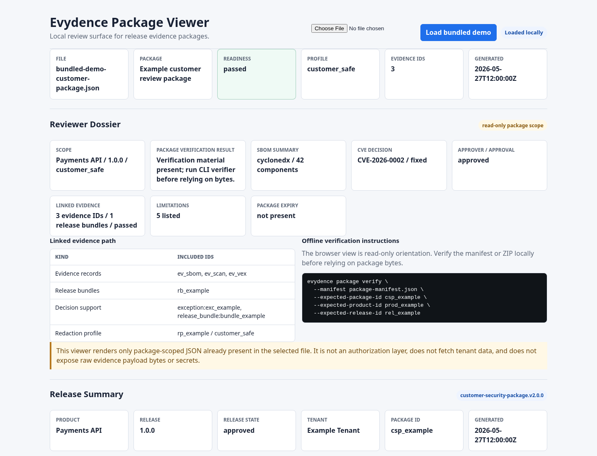
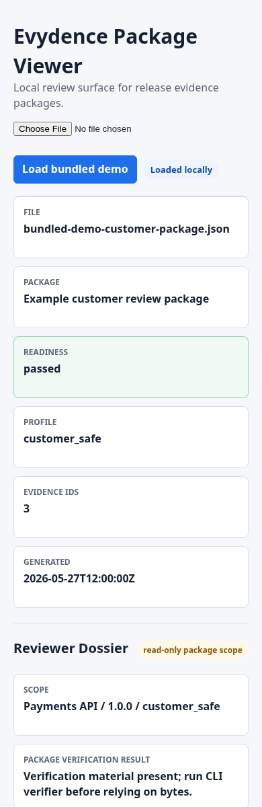
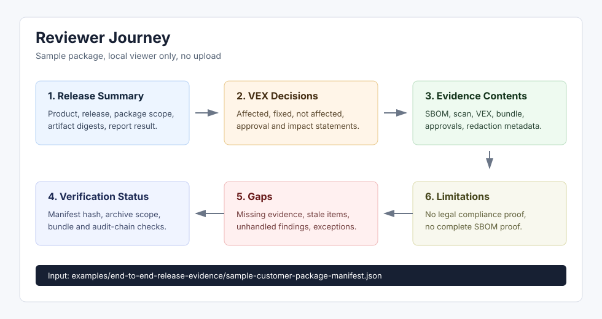

# View Release And Customer Packages Locally

Evydence is API-first, but the repository includes a local package viewer at
`site/package-viewer/index.html` for customer-package and release-evidence
review.

## Reviewer Surface Boundary

Evydence intentionally keeps operator workflows API/CLI-first. Operators create
products, releases, evidence, redaction profiles, customer packages, and portal
access records through the API or CLI so tenant authorization, scopes,
idempotency, audit entries, and package expiry stay server-side.

The local package viewer is an offline inspection helper. It reads files that a
reviewer already has on disk, renders package-scoped JSON as text, and never
grants or checks access to tenant resources. Do not treat the viewer as a
customer portal, identity provider, access-control layer, or evidence source of
truth.

The only browser-facing server surface currently in scope is a minimal
customer-portal review page backed by the existing package-token exchange and
download endpoints. That page may collect a portal token and optional NDA
acceptance fields, but all access decisions must remain in the API. It must not
expose raw evidence payloads, object-store paths, internal notes, token hashes,
private keys, or customer data outside the scoped package.

When the API is running, open `/v1/customer-portal/package/view` to use the
server-backed review page. It accepts portal tokens only in form bodies, sets
no-store browser cache headers, and renders the same scoped package data exposed
by `POST /v1/customer-portal/package`. The page includes a separate ZIP
download form so the token is never copied into the returned HTML or a URL.
For the full reviewer workflow, see
[Review a customer package](review-customer-package.md).

Open the file in a browser, then select a JSON package, readiness report,
evidence bundle, or package manifest from disk. The viewer runs entirely in the
browser and does not upload data. To inspect a non-sensitive fixture without
running the API, load
`examples/end-to-end-release-evidence/sample-customer-package-manifest.json` or
press **Load bundled demo** in the viewer.

The top **Reviewer Dossier** is the quickest read-only path through a package.
It summarizes package scope, package verification status, SBOM metadata, CVE
decision status, approver or approval context, linked evidence, limitations, and
the offline `evydence package verify` command. The browser does not verify the
package bytes itself; use the CLI verifier before relying on a manifest or ZIP
archive.

The **Manifest Summary And Proof** section gives a second proof-oriented view:
schema and package identifiers, redaction profile, manifest-hash field,
evidence link status, signed release bundle material, audit-chain material,
decision-export presence, and the package verification result display. It is a
review aid for redaction-approved package content only.

Before sharing or reviewing a package, use the offline verifier for hash,
structure, archive metadata, and optional evidence-bundle signature checks:

```sh
go run ./cmd/evydence package verify \
  --manifest examples/end-to-end-release-evidence/sample-customer-package-manifest.json
```

The same fixture is available as
`examples/end-to-end-release-evidence/sample-customer-package.zip` for archive
verification workflows.

Customer package ZIP exports generated by the API include a self-contained
`report.html` file. Open it directly from the unpacked archive when a static
release summary is easier to review than raw JSON. The report uses only the
redacted package manifest and local inline styles.


The screenshots below are generated from the viewer's bundled demo package, not
from customer data. They show the desktop and narrow-screen review layouts,
included evidence summaries, readiness status, and limitations. Use them as UI
orientation only; screenshots are not package verification evidence, legal
compliance proof, certification, complete SBOM proof, authoritative scanner
results, or a secure-release guarantee.





To regenerate these local proof assets after changing the viewer, run:

```sh
scripts/capture_package_viewer_screenshots.sh
```

The sample reviewer journey is:



1. Read the release summary to confirm product, release, package scope,
   artifact digests, and readiness result.
2. Use the reviewer dossier to confirm read-only package scope, package
   verification status, linked evidence, limitations, and the offline
   verification command.
3. Inspect vulnerability and VEX decisions to see the recorded status,
   impact/action statement, approval context, and whether the decision is
   customer-visible.
4. Review evidence contents to confirm which SBOM, scan, VEX, release bundle,
   approval, exception, and redaction metadata are included.
5. Check verification status before relying on package bytes for review.
6. Read gaps for missing evidence, stale evidence, unhandled findings, and
   exceptions that did not unblock readiness.
7. Read assumptions and limitations before using the package in a customer or
   internal review.

Use it for:

- checking a release-readiness report before sending a customer package;
- inspecting package manifests and limitations;
- reviewing artifact, SBOM, vulnerability, VEX, approval, exception, readiness,
  contents, and verification sections;
- checking manifest summary, evidence link status, signed release bundle
  material, package verification result, and limitation/non-claim copy;
- following the reviewer checklist for package scope, included evidence,
  excluded evidence, hash/signature verification, non-claims, and escalation
  path;
- reading evidence-bundle metadata during an offline review;
- confirming that a shared package does not contain raw evidence payload bytes
  or secrets.

Do not use the viewer as authorization. Customer access still depends on
server-side package scopes, redaction profiles, expiry, and access auditing.
Viewer output is not legal compliance proof, certification, complete SBOM
proof, an authoritative vulnerability result, or a secure-release guarantee.
