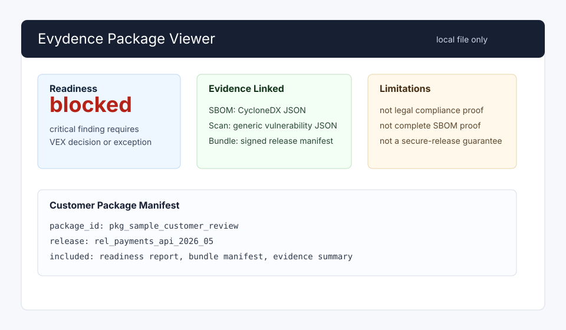

# View Release And Customer Packages Locally

Evydence is API-first, but the repository includes a local package viewer at
`site/package-viewer/index.html` for customer-package and release-evidence
review.

Open the file in a browser, then select a JSON package, readiness report,
evidence bundle, or package manifest from disk. The viewer runs entirely in the
browser and does not upload data. To inspect a non-sensitive fixture without
running the API, load
`examples/end-to-end-release-evidence/sample-customer-package-manifest.json` or
press **Load bundled demo** in the viewer.

Before sharing or reviewing a package, use the offline verifier for hash,
structure, archive metadata, and optional evidence-bundle signature checks:

```sh
go run ./cmd/evydence package verify \
  --manifest examples/end-to-end-release-evidence/sample-customer-package-manifest.json
```

The same fixture is available as
`examples/end-to-end-release-evidence/sample-customer-package.zip` for archive
verification workflows.



Use it for:

- checking a release-readiness report before sending a customer package;
- inspecting package manifests and limitations;
- reviewing artifact, SBOM, vulnerability, VEX, approval, exception, readiness,
  contents, and verification sections;
- reading evidence-bundle metadata during an offline review;
- confirming that a shared package does not contain raw evidence payload bytes
  or secrets.

Do not use the viewer as authorization. Customer access still depends on
server-side package scopes, redaction profiles, expiry, and access auditing.
Viewer output is not legal compliance proof, certification, complete SBOM
proof, an authoritative vulnerability result, or a secure-release guarantee.
